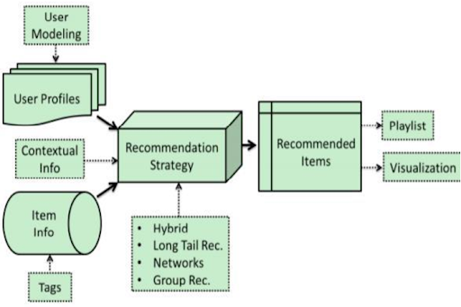
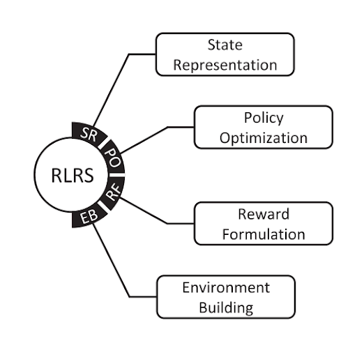
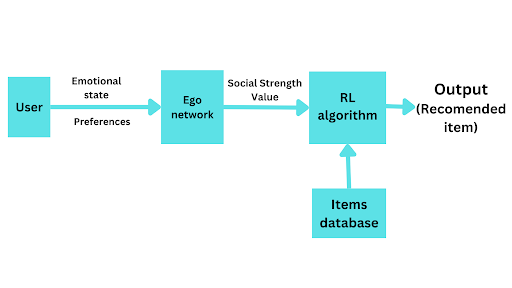
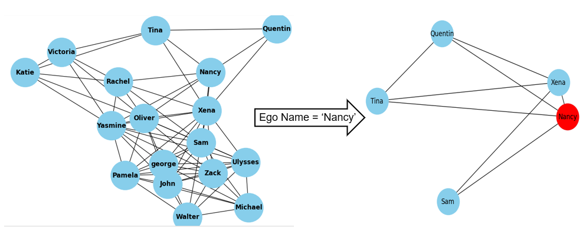

[comment]: # "This is the standard layout for the project, but you can clean this and use your own template"

# Reinforcement Learning Enabled Egocentric Social Network Based Activity Recommendation System for Providing Emotional Support

#### Team

- E/18/180, Kodituwakku M. K. N. M., [e18180@eng.pdn.ac.lk](mailto:e18180@eng.pdn.ac.lk)
- E/18/242, Nimnadi J. A. S., [e18242@eng.pdn.ac.lk](mailto:e18242@eng.pdn.ac.lk)
- E/18/266, Premathilaka K. N. I., [e18266@eng.pdn.ac.lk](mailto:e18266@eng.pdn.ac.lk)

#### Supervisors

- Ms. Yasodha Vimukthi, [yasodhav@eng.pdn.ac.lk](mailto:yasodhav@eng.pdn.ac.lk)
- Dr. Dharshana Kasthurirathna, [dharshana.k@sliit.lk](mailto:dharshana.k@sliit.lk)

#### Table of content

1. [Abstract](#abstract)
2. [Motivation](#motivation)
3. [What is a Recomendation System?](#recomendation-system)
4. [Related works](#related-works)
5. [Methodology](#methodology)
6. [Implementations](#experiment-setup-and-implementation)
7. [Results and Analysis](#results-and-analysis)
8. [Conclusion](#conclusion)
9. [Publications](#publications)
10. [Links](#links)

---

<!-- 
DELETE THIS SAMPLE before publishing to GitHub Pages !!!
This is a sample image, to show how to add images to your page. To learn more options, please refer [this](https://projects.ce.pdn.ac.lk/docs/faq/how-to-add-an-image/)
 
-->

## Abstract
Here we presents a comprehensive analysis of research on media recommendation systems, encompassing music, movies, and books. Traditional recommender systems primarily focus on factors such as user preferences, genre similarity, and collaborative filtering, often neglecting the emotional impact and personalization of media on users. To address this limitation, this research explores the integration of reinforcement learning and egocentric networks to improve user experience through emotional engagement and social context.  The study aims to enhance the personalization and relevance of recommendations, addressing the limitations of traditional systems and paving the way for more emotionally and socially attuned media suggestions. The findings of this research highlight the potential of RL and egocentric networks in improving media recommendation systems and providing users with more personalized and emotionally attuned media suggestions.

## Motivation
In response to the pervasive loneliness epidemic, our project aims to revolutionize emotional support through a Reinforcement Learning Enabled Recommendation System. Addressing the risks associated with loneliness, we leverage social connections, preferences, and personalized recommendations to enhance mental well-being, offering tailored activities, music, books, or films. Our mobile app ensures high efficacy with ease, low effort, and strong motivation for fostering meaningful connections and combating the alarming consequences of social isolation. Below image shows a result of reasearch for selected set of peoples number of minutes spent alone per day according to their age groups. 

## What is a Recommendation System?
A recommendation system is a software algorithm that analyzes user preferences, behaviors, or interactions to suggest personalized content, products, or services, enhancing user experience and engagement. There are several components in recommendation systems. They are User Profile, Item Profile, Recommendation Engine, Data Source, Algorithm, Evaluation Metrics, User Interface, Feedback Loop. Below image show how general structure of a recommendation system.

 

## Related works
When go through the related reaserch work we could identify several methodologies have been used to develop recommendation systems. 

#### A. Traditional Methods
Traditional methods can be classsified into main three types. Content based filtering, Colloborative filtering and Hybrid methods. Content-Based Filtering suggests items by analyzing their features, while Collaborative Filtering recommends based on user preferences—either by finding similar users (User-Based) or similar items (Item-Based). Hybrid methods combine both item characteristics and user preferences for a comprehensive and effective recommendation approach.

#### B. Deep Learning Techniques
Deep learning techniques, including Multi-Layer Perceptron, Autoencoder, Convolutional Neural Network, Recurrent Neural Network, and others, enhance recommendation systems. These methods leverage diverse data types, such as emotions detected through facial expressions or text inputs, to provide personalized and accurate recommendations.

#### C. Reinforcement Learning Technique
Reinforcement Learning based recommendation systems are mainly based on a framework with four stages. They are state representation, policy optimization, reward formulation and environment building. 

 

**State representation** can be can be items, features (user, item, context), or encoded embeddings for effective training in DRL-based RSs. There are main three types of representations can be identified as RS1, RS2 and RS3. In the RS1 the items are treated as states, in the RS2 the features from users, items and contexts are treated as states, while the RS3 considers the encoded embeddings. **Policy optimizations** involves choosing actions based on states. Traditional RL methods include tabular (policy iteration, Q-learning) and approximate (fitted Q, gradient value iteration), while DRL methods categorize into value-based (DQN), policy gradient (REINFORCE), and actor-critic (DDPG). **Reward formulation** is crucial for guiding agent behavior. Rewards can be simple numerical signals (sparse reward) or functions of observations (rich reward), designed through trial-and-error in the absence of definite rules.**Building environments** for RLRSs evaluation is challenging. Methods include offline (static dataset), simulation (user model), and online (real users, real-time) approaches, each with varying complexities and costs.

Below images shows how recent researchers used above framework to their research. 

## Methodology
We are proposed a mobile application with an activity recommendation system to uplift the users mental health. The application will be taken two inputs from the users which are mentel state of the user and their preferences. We are looking to recommend three types of actrivities to users according to their preferences. They are music, movie and book. The recommendation system will be eveloped by intigrating reinforcement learning and ego centric network to achive more personalized system. Below image will show the arcitecture of the proposed system. 

Integrating reinforcement learning and ego-centric networks, we are looking to develop a system for personalized emotional support. This system will understand and respond to each user's emotional state and preferences, offering an adaptive user experience with real-time responses. Through focused content delivery aligned with users' emotional history, it aims to provide tailored and meaningful engagement. Users will be encouraged to participate in discussions and seek support, fostering an active and supportive community. The system's continuous learning capability, driven by user interactions, ensures an evolving and responsive platform for sustained emotional well-being.

## Implementations
1. **User Inputs:**
   - Mental State: Represented as a categorical variable (e.g., Happy, Sad, Stressed, Relaxed).
   - Preferences: User preferences for music, movies, and books. This could be a set of genres or specific items.

2. **Reinforcement Learning Module:**
   - The RL module takes user inputs and employs a reinforcement learning algorithm to recommend activities.
   - The RL algorithm learns from user feedback and adjusts recommendations over time.

3. **Ego-Centric Network:**
   - Represents the user's network which have similar preferences.
   - Each node in the network represents a person, and edges represent relationships.
   - From the entrire network we can filter out one person's egocentric network. 
   

4. **Personalized Recommendations:**
   - The RL module and ego-centric network work together to generate personalized recommendations.
   - The ego-centric network helps in understanding the user's preferences based on the preferences of their connections.

5. **Output:**
   - The system outputs recommended activities: music, movie, and book, based on the integration of RL and ego-centric network.

6. **Feedback Loop:**
   - The system continuously learns and updates recommendations based on user feedback.
   - User interactions and preferences provide valuable data to improve the system's recommendations.

## Publications
[//]: # "Note: Uncomment each once you uploaded the files to the repository"

1. [Semester 7 report](https://drive.google.com/file/d/1xcnS8RT5Oespy-3DoWMvOHjmXRRaE2qW/view?usp=sharing)
2. [Semester 7 slides](https://drive.google.com/file/d/1NWSspUSANlgXIz6vvp6gNuUE-fVt16DS/view?usp=sharing)
<!-- 3. [Semester 8 report](./) -->
<!-- 4. [Semester 8 slides](./) -->
<!-- 5. Author 1, Author 2 and Author 3 "Research paper title" (2021). [PDF](./). -->

## Links

[//]: # ( NOTE: EDIT THIS LINKS WITH YOUR REPO DETAILS )

- [Project Repository](https://github.com/cepdnaclk/e18-4yp-Reinforcement-Learning-enabled-Recommendation-System-For-Emotional-Support)
- [Project Page](https://cepdnaclk.github.io/e18-4yp-Reinforcement-Learning-enabled-Recommendation-System-For-Emotional-Support)
- [Department of Computer Engineering](http://www.ce.pdn.ac.lk/)
- [University of Peradeniya](https://eng.pdn.ac.lk/)

[//]: # "Please refer this to learn more about Markdown syntax"
[//]: # "https://github.com/adam-p/markdown-here/wiki/Markdown-Cheatsheet"
